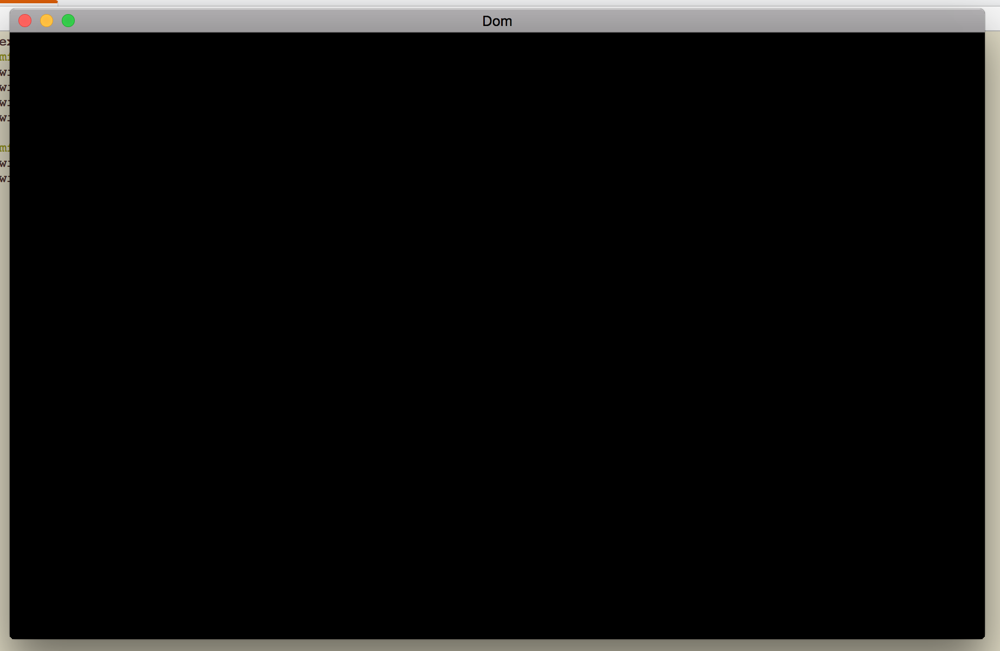

# Context Creation

This folder corresponds to the code (largely setup and configuration) found in the [context creation](https://open.gl/context) section of the https://open.gl
tutorial. The Makefile works nicely with macOS so if you're using linux this will need to be modified.

The result of this program is:

