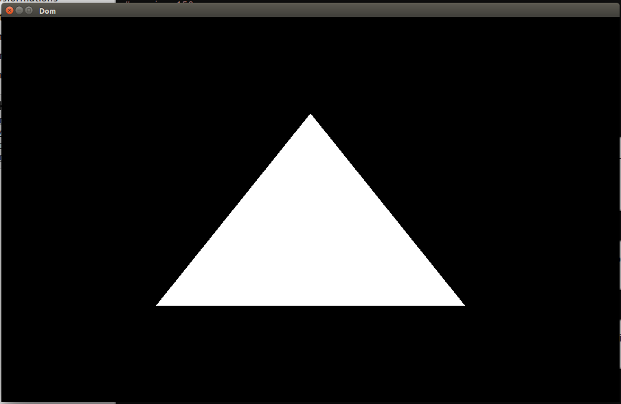
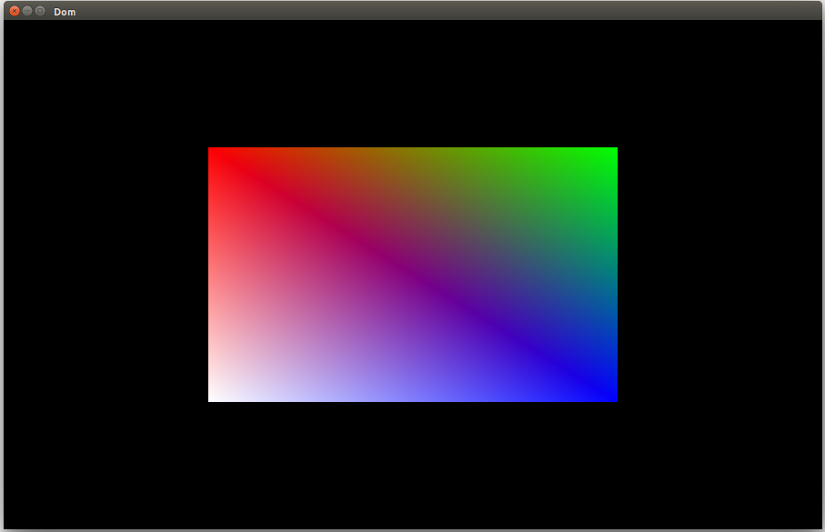

# Drawing Polygons

This folder corresponds to the code found in the [drawing polygons](https://open.gl/drawing) section of the https://open.gl tutorial.
The Makefile works nicely on Linux and macOS. This section taught about vertex buffer objects, vertex array objects, element buffer objects,
vertex shaders, fragment shaders, and drawing from both vertex buffer objects and element buffer objects and how we can be more memory efficient
by drawing from the latter. In the first part of this section we draw a white triangle:

And in the second part we draw two triangles together to form a rectangle. Each vertex of the rectangle has a color associated with it which gives
us the rainbow effect below:

